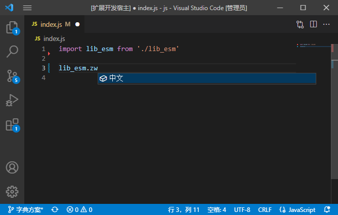
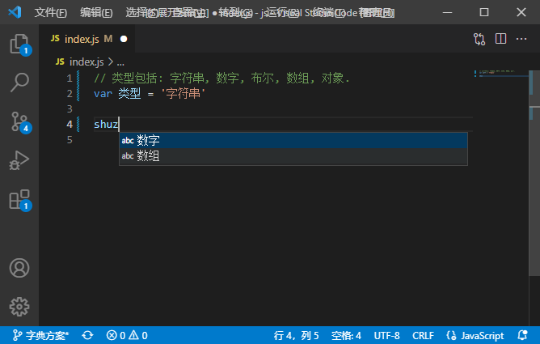
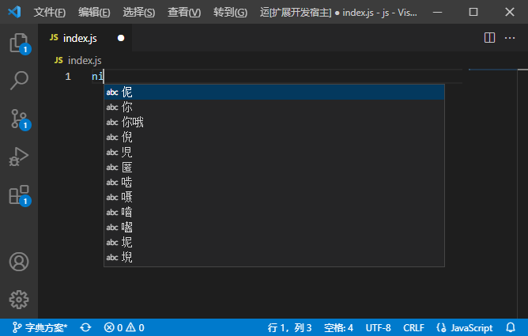
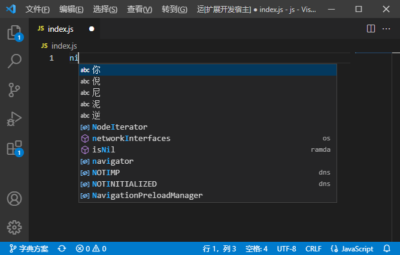
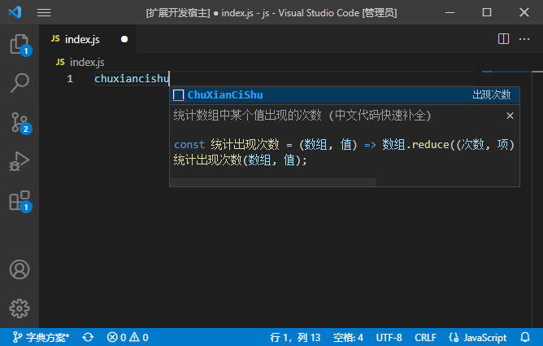

# 中文代码快速补全

本插件提供类似中文输入法的功能, 能结合当前代码上下文快速输入中文.

支持拼音, 五笔等常见的输入方法, 也允许您自定义自己的输入方法, 请参阅[这里](文档/拼写字典说明.md).

## 安装

访问[商店](https://marketplace.visualstudio.com/items?itemName=CodeInChinese.ChineseInputAssistant)安装即可.

## 功能简介

### 获得 vscode 提供的补全项

- 本插件可以获得 vscode 提供的提示项, 如引入的库的变量或函数名.
- 需要安装对应语言的插件.
- 某些语言暂不支持.

### 获得当前文件分词

- 本插件可以获得当前正在编辑的文件的分词.
- 注释, 变量名等均会被识别.

### 本地输入法

- 本插件内置一个简单的本地输入法.
- 内置一些常用词库, 可以在配置中调整.
- 也允许您自定义输入法的词库, 请参阅[这里](文档/本地输入法字典说明.md).

### 网络输入法

- 本插件允许您使用网络输入法.
- 目前支持百度联想和谷歌输入法, 可以在配置中调整.
- 同时可配置网络输入法的代理.

### 用户片段

本插件内置了一些用户片段, 请参阅[此说明](文档/片段功能说明.md).

## 其他配置

### 禁用补全的语言

可通过语言后缀名, 配置是否禁用本插件.

例如对于`.md`文件, 使用补全反而会有不必要的打扰, 就可以在配置中禁用.

### 触发补全的字符串

可配置触发补全的字符.

例如对于`PHP`语言, 可以配置输入字符`$`时触发补全.

## 更多

更详细的说明可以参阅[这里](文档/功能简述.md).

## 版本更新说明

[CHANGELOG](CHANGELOG.md)

## 贡献

欢迎任何贡献! 请参阅[此说明](文档/贡献指南.md).

## 联系我们

- QQ 群: 620225373
- 中文编程知乎专栏: https://zhuanlan.zhihu.com/codeInChinese

## 其他平台类似支持

- [IntelliJ IDEA/WebStorm/PyCharm...](https://gitee.com/tuchg/ChinesePinyin-CodeCompletionHelper)
- [VisualStudio](https://github.com/stratosblue/ChinesePinyinIntelliSenseExtender)

## 协议

本项目使用 BSD3 协议.

但`字典`文件夹中的部分文件来自[rime](https://github.com/rime/)项目, 其协议以相关项目为准.
