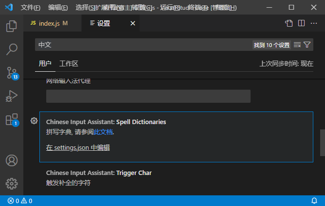

# 1.4 到 1.5 版本迁移说明

本文档说明 1.4 迁移到 1.5 版本的注意事项.

注: 本次升级修改较大, 有任何问题请提 issue.

## 变更

### 字典方案

相比 1.4 版本, 在 1.5 版本中引入了`字典`方案.

简单的说, 插件的工作原理是:

1. 通过各种方式收集用户可能会输出的中文.
2. 将中文转换为其拼写形式, 例如将`你好`转换为`nihao`.
3. 当用户输入这些拼写形式时, 在 vscode 提示框中显示对应的汉字.

在 1.4 版本中, 第 2 步的转换是通过一些库实现的, 不可配置.
在 1.5 版本中, 允许用户提供`字典`来配置转换的方案, 并且允许同时使用多个字典.

插件内置了三个字典:

- 拼音: pinyin_simp.dict.txt
- 五笔 86: wubi86.dict.txt
- 五笔 98: wubi98.dict.txt

插件默认启用的是`拼音`, 你可以在这里进行修改:

例如, 如果你使用五笔, 你可以将`pinyin_simp.dict.txt`注释, 然后打开`wubi86.dict.txt`.

你也可以在这里写完整路径, 使用自己的字典.

注: 我们不太了解五笔, 这个五笔字典应该是五笔`全码`, 如果有任何错误, 或希望加入例如`四码`的输入方式, 请提 issue.

### 触发补全的字符

在 1.4 中, 触发补全的字符是固定的, 在 1.5 中则可以进行配置.

例如对于`PHP`语言, 可以配置输入字符`$`时触发补全.

### 禁用补全的语言

在 1.4 中, 插件对所有语言有效, 在 1.5 中则可以进行配置.

例如对于`.md`文件, 使用补全反而会有不必要的打扰, 就可以在配置中禁用.

## 新增

### 本地输入法

新增了本地输入法功能, 同样可以通过配置字典来自定义词组.

插件默认启用的是`拼音`, 你可以在这里进行修改:

