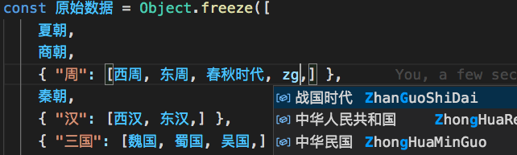
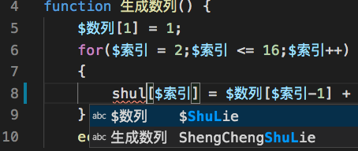
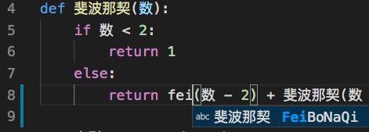
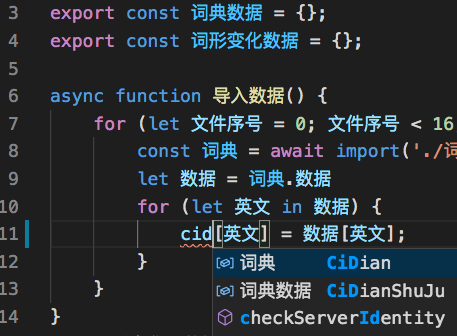
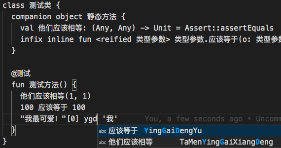
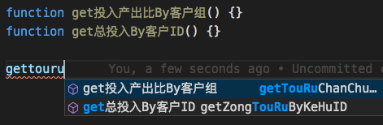
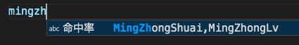

## 功能简述

在不影响 VS Code 的现有代码补全功能的前提下，不用切换到第三方中文输入法，就可以通过拼音等方式获得对应的中文代码补全。

## 术语表

参考：[VSC IntelliSense 官方文档](https://code.visualstudio.com/docs/editor/intellisense)

| 中文     | 英文               | 简述                                                                                                     |
| -------- | ------------------ | -------------------------------------------------------------------------------------------------------- |
| 代码补全 | code completion    |                                                                                                          |
| 触发字符 | trigger character  | 比如 JavaScript 中的 .                                                                                   |
| 建议弹窗 | suggestions widget | 光标下方的包含建议补全项的窗口                                                                           |
| 关键词   | keyword            | 编程语言语法中的保留关键词，如 [JS](https://www.w3schools.com/js/js_reserved.asp)中的 const，continue 等 |
| 标识符   | identifier         | 关键词之外的代码内容，包括变量、方法、类名等等                                                           |
| 字段     |                    | 包括标识符、注释中的中文字段                                                                             |

关键词、标识符分类：
| 图标 | 中文 | 英文 | 简述 |
| ------------- | ------------- | ------------- | ------------- |
|  | 方法 | method, function |
|  | 变量 | variable |
|  | 域 | field |
|  | 类 | class |
|  | 接口 | interface |
|  | 模块 | module |
|  | 属性 | Properties and Attributes |
|  | 枚举 | Values and Enumerations |
|  | 引用 | reference |
|  | 关键词 | keyword |
|  | 颜色 | color |
|  | 单位 | unit |
|  | 代码片段 | (code) snippet |
|  | 词语 | Words | 不归属于上述种类的内容

# 详细功能

编程语言按字母顺序排列。

## JavaScript

此部分 JS 相关，今后逐步补充其他语言。**_由于各测试平台的库有所不同，补全项中的自动导入（auto import）相关部分不在测试范围内。_**

### 无本插件时

使用 VS Code 默认补全配置。在新工作区中拷贝[测试目录](../供测试/js/)进行测试。

#### 英文标识符、关键词

下面的用例，按照建议弹窗第一项的种类分成几部分。如有更加接近实用的用例，欢迎改进。

**_可能不需输入所有字符，就会出现在建议弹窗内容第一项，并且之后还有其他项（种类可能各异）。以下无特殊说明也是如此。_**

| 种类             | 输入          |
| ---------------- | ------------- |
| 方法（语言内置） | isFinite      |
| 方法（自定义）   | add           |
| 变量（语言内置） | console       |
| 变量（自定义）   | lib_esm       |
| 域               | add.arguments |
| 类               | aClass        |
| 关键词           | new           |
| 代码片段         | log           |
| 词语             | zero          |
| 模块             | 【待添加】    |
| 枚举             | 【待添加】    |
| 接口             | 【暂未重现】  |
| 属性             | 【暂未重现】  |
| 引用             | 【暂未重现】  |

#### 中文标识符

| 种类 | 输入             |
| ---- | ---------------- |
| 域   | lib_esm.中文     |
| 变量 | 中文变量         |
| 词语 | lib_esm.中文变量 |

【待补完】

### 安装本插件后

#### 英文标识符、关键词

应与无插件时效果相同。

#### 中文标识符

中文输入状态下，应与无插件时效果相同。

下面为英文输入状态下，不同中文匹配方式。

- 全拼

| 种类     | 输入             | 补全项文本   |
| -------- | ---------------- | ------------ |
| 方法     | jf               | 加法         |
| 变量     | zwbl             | 中文变量     |
| 域       | lib_esm.zw       | 中文         |
| 类       | xiaol            | 小类         |
| 代码片段 | chux             | ChuXianCiShu |
| 词语     | lingd            | 零蛋         |
| 关键词   | 【无中文关键词】 |
| 模块     | 【待添加】       |
| 枚举     | 【待添加】       |

- 五笔

98 全码下，输入“hljw”，出现“战国时代”

## C++

测试时使用[此语言插件](https://marketplace.visualstudio.com/items?itemName=ms-vscode.cpptools)。测试源码[在此](../供测试/cpp/main.cpp)。

### 无本插件时

| 种类 | 输入    | 补全项文本 |
| ---- | ------- | ---------- |
| 方法 | oval.求 | 求面积     |
| 变量 | oval    | oval       |
| 变量 | 椭      | 椭圆       |

### 安装本插件后

无本插件的用例仍可用之外：

注意：“椭圆”的种类本来是“变量”，现在是“词语”

| 种类       | 输入                 | 补全项文本                       |
| ---------- | -------------------- | -------------------------------- |
| 方法       | oval.qiu 或 椭圆.qiu | 补全为（仅支持当前文件中的字段） |
| **_词语_** | tuoyuan              | 椭圆                             |

## PHP

测试时使用[此语言插件](https://marketplace.visualstudio.com/items?itemName=ms-python.python)。测试源码[在此](../供测试/斐波那契.py)。

### 无本插件时

| 种类   | 输入  | 补全项文本 |
| ------ | ----- | ---------- |
| 方法   | join  | join       |
| 关键词 | echo  | echo       |
| 变量   | $数列 | $数列      |

### 安装本插件后

无本插件的用例仍可用之外：

| 种类 | 输入   | 补全项文本 |
| ---- | ------ | ---------- |
| 词语 | shulie | $数列      |

## Python

测试时使用[此语言插件](https://marketplace.visualstudio.com/items?itemName=ms-python.python)。测试源码[在此](../供测试/斐波那契.py)。

### 无本插件时

| 种类   | 输入  | 补全项文本 |
| ------ | ----- | ---------- |
| 方法   | print | print      |
| 关键词 | for   | for        |
| 变量   | 数    | 数         |

### 安装本插件后

无本插件的用例仍可用之外：

| 种类 | 输入      | 补全项文本 |
| ---- | --------- | ---------- |
| 变量 | feibonaqi | 斐波那契   |

## TypeScript

测试源码[在此](../供测试/加载词典.ts)。

### 无本插件时

| 种类   | 输入     | 补全项文本 |
| ------ | -------- | ---------- |
| 方法   | print    | print      |
| 关键词 | function | function   |
| 变量   | 词典数据 | 词典数据   |

### 安装本插件后

无本插件的用例仍可用之外：

| 种类 | 输入        | 补全项文本 |
| ---- | ----------- | ---------- |
| 变量 | cidianshuju | 词典数据   |

## 编程语言无关

### 无语言支持插件时

如果并未安装当前源码文件对应的编程语言插件，将按照文本文件处理，支持当前文件中的中文字段的补全。比如在未安装 Kotline 插件时，在[此源码](../供测试/你好.kt) 中输入“ygd”会出现“应该等于”补全。

### 第三方 API

配置项中可以选择百度搜索、谷歌拼音等 API。在输入英文字符时，建议弹窗中会出现对应中文补全项。

下面选择百度搜索，以 [JavaScript 例程](../供测试/js/) 为例：

输入“jiafa”，在“加法”方法之外，还有几项拼音相关中文，种类为“词语”，如“假发”。

当分段输入时，基于每段输入提供补全项。比如在谷歌输入下，先输入“qici”有“齐次”等多个补全项，再输入“xianxing”有“线性/显性”等补全项；作为对比，连续输入“qicixianxing”的话只有“线性齐次”一个补全项。

如果访问 API 受阻，会提示用户。

### 中英文混合

支持中英文混合的标识符补全，在[此源码](../供测试/中英混合.js) 中输入“gettouru”出现`get投入产出比By客户组`

### 多音字

配置项中可以开启多音字。之后在[这里](../供测试/js/index.js) 输入“duozhong”或者“duochong”都会出现“多重笛卡尔积”

### 代码片段

插件中集成了几个编程语言的[代码片段](../片段)。可以通过中、英、拼音等方式触发补全。比如在 JS 源码中输入“array”、“chuxian”或“出”都能触发“出现次数”代码片段。

## 不同语言的测试

各种编程语言在全拼下已实测过的：

- JavaScript

- PHP

对 $ 开头的变量名，直接输入拼音即有提示：

- Python

- TypeScript

当无编程语言支持插件时，也支持当前文件中的中文字段补全：

同样支持中英混合命名：

### 多音字

如存在多音字，可以匹配任意拼音组合：

