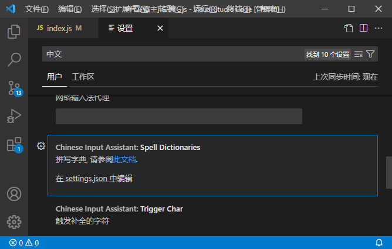

# 拼写字典说明

本插件通过字典配置您的输入方式.

## 内置字典

本插件内置了常见的输入方式对应的字典, 包括:

- 全拼: pinyin_simp.dict.txt
- 小鹤双拼: xiaohe.dict.txt
- 五笔 86: wubi86.dict.txt
- 五笔 98: wubi98.dict.txt

您可以同时使用这些字典, 也可以只使用一个或几个.

这些字典来自于项目[rime](https://github.com/rime/).

在这里配置:

## 自定义字典

本插件允许您自定义自己的字典.

编写自定义字典的方式, 请参考[这里](自定义字典.md).

您可以在任何地方编写您的字典, 只需将字典的完整路径输入配置中即可.
